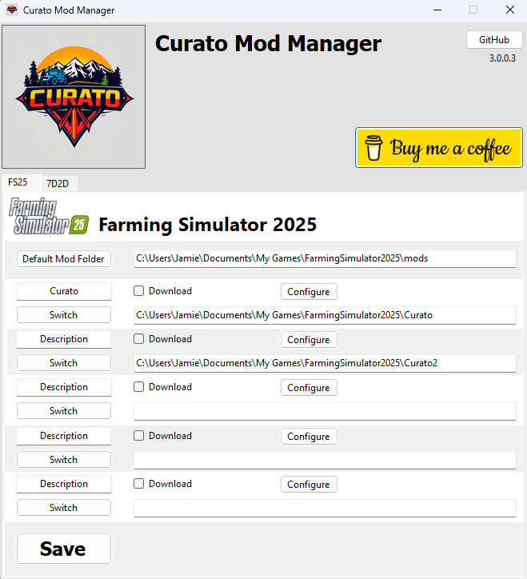
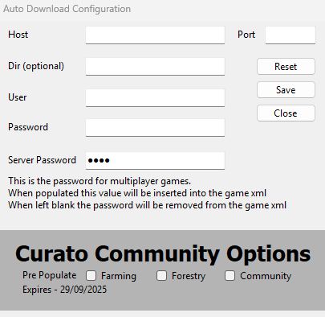
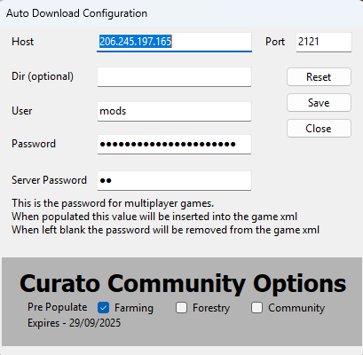

### **Curato Mod Manager V2.0.0.1 - User Guide**

* * * * *

#### **Getting Started**

-   **No Installation Required**: Simply run the `.exe` file to use the application.
-   **Antivirus Alerts**: Some antivirus software may flag the file because it interacts with the system registry to store data. This is a false positive---add an exception in your antivirus to avoid disruptions.
-   **First Launch**: On a new setup or computer, the app interface will appear as shown below. The **default mod folder**path should automatically populate.

  

* * * * *

### **Home Screen Features**

The home screen provides the core functionality for managing your mod profiles and configurations. Here's an overview:

#### **Main Buttons and Options**

1.  **Default Mod Folder**

    -   Resets the game to use the default mod folder.
2.  **Download Checkbox** *(Optional)*

    -   Enable this option to automatically download missing mods from the remote FTP server when switching profiles.
3.  **Set Password Checkbox** *(Optional)*

    -   Enable this option to set the server password automatically when switching profiles.
4.  **Configure**

    -   Opens a window to configure FTP settings and the game server password.
5.  **Switch**

    -   Applies the selected profile, downloading mods and setting passwords if the relevant checkboxes are enabled.
6.  **Description**

    -   A free-form text field for users to add notes or details about the selected profile.

#### **Mod Folder Management**

-   **Mod Folder Fields**

    -   Enter the paths to your mod folders here. Ensure that the folders already exist on your system.
-   **Save**

    -   Saves the configuration changes on this page.
    -   **Important**: You must press "Save" after making changes before switching profiles. There is no need to save again unless further changes are made.

#### **External Links**

-   **GitHub**

    -   Opens the GitHub repository for this project.
-   **Buy Me a Coffee**

    -   A quick way to support the project through donations.

* * * * *

### **Configuration Screen**

The **Configuration Screen** allows you to set up the necessary FTP and server credentials. Each field is explained below:

#### **FTP Settings**

-   **Host**

    -   The FTP host address.
-   **Port**

    -   The FTP port number.
-   **Dir (Optional)**

    -   Specify a directory if the FTP connection does not automatically navigate to the server's mod folder.
-   **User**

    -   The FTP username.
-   **Password**

    -   The FTP password.
-   **Pre Populate**

    -   Loads full configuration data from a remote source.
    -   **Note**: This feature is primarily for Curato Farm members, with limited access for Community members using the semi-public server.

#### **Game Settings**

-   **Game Password** *(Optional)*
    -   Enter the game server password here. When switching profiles, the app will set this password automatically for quick server access.

#### **Utility Buttons**

-   **Reset**

    -   Clears all values and resets the fields to blank.
-   **Save**

    -   Saves the current configuration.
-   **Close**

    -   Closes the configuration window.

* * * * *

### **Quick Tips**

1.  **Always Save Changes**: Remember to press "Save" after configuring settings to ensure they are applied.
2.  **Optional Features**: Use checkboxes (e.g., "Download" or "Set Password") only if needed for your workflow.
3.  **Support the Project**: Visit the GitHub page for updates or consider donating to help maintain and improve the project.

Enjoy seamless mod management with **Curato Mod Manager V2.0.0.1**!
